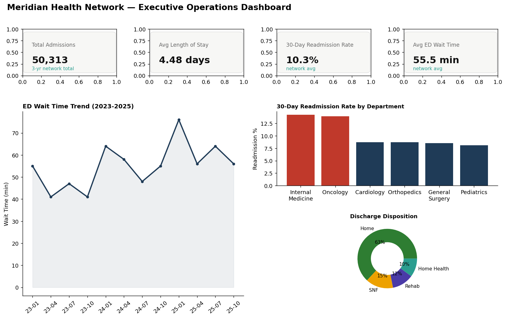
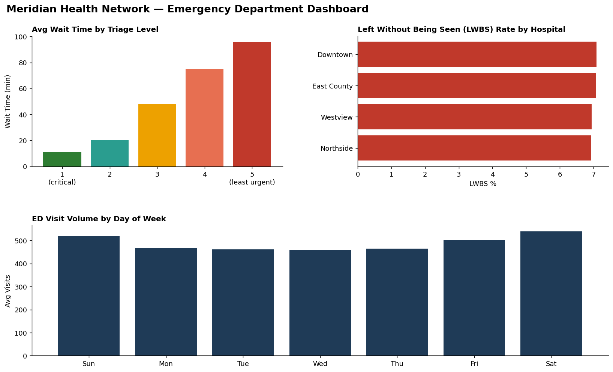
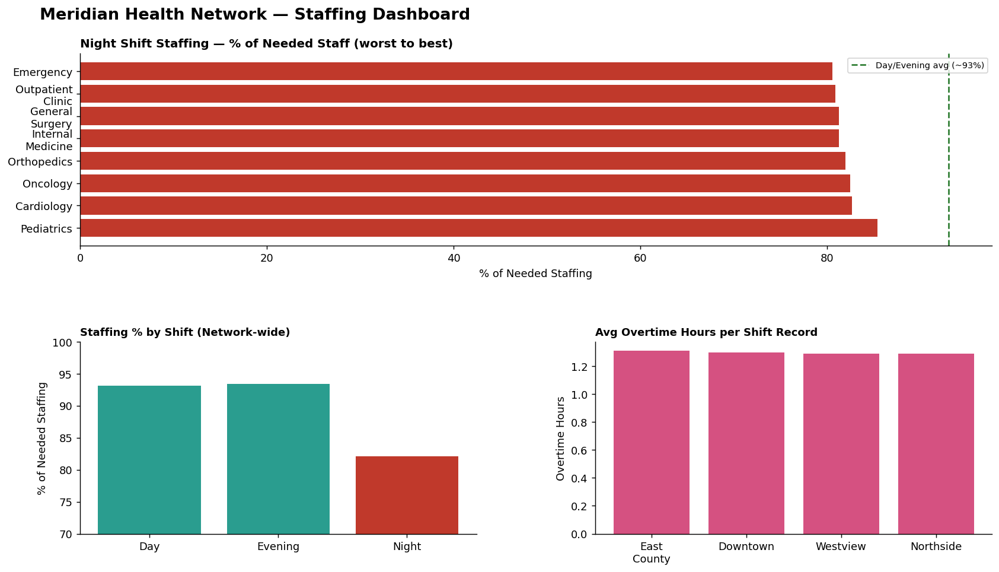
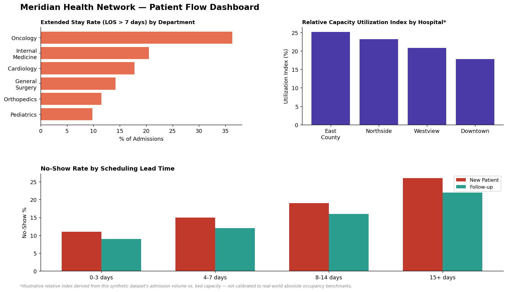
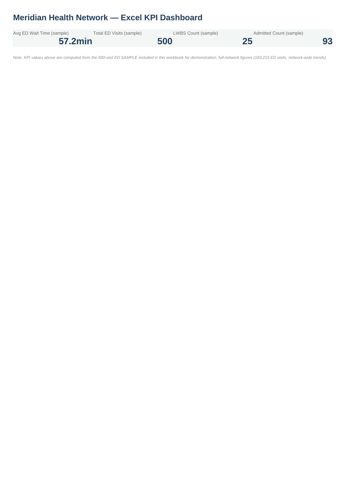

# Meridian Health Network — Operational Analytics


## Business Problem

Meridian Health Network — a 4-hospital regional system — is facing rising
emergency department wait times, uneven staffing, appointment no-shows, and
concentrated readmissions in specific departments. Leadership needs to know
the actual root causes before committing capital or headcount to a fix, not
just a list of symptoms.

## Dataset

**This dataset is entirely synthetic.** Real multi-hospital operational data
at this granularity is protected health information (HIPAA) and isn't
available as a combined public dataset. A generator (`data/generate_data.py`)
built 414,287 rows across ED visits, admissions, appointments, and staffing
shifts (2023-2025), with deliberate, documented realistic patterns (seasonal
ED surges, Night-shift staffing gaps, triage-based wait time structure) so
the analysis has genuine signal to uncover — exactly like a real hospital
network's data would.

## Executive Operations Dashboard



## Emergency Department Dashboard



## Staffing Dashboard



## Patient Flow Dashboard



## Key Findings

1. **ED wait times climbed structurally**: 46.6 → 54.5 → 64.0 minutes average
   (2023 → 2025), confirmed via rolling average, not a single bad quarter.
2. **Triage severity explains most wait-time variation** (ANOVA p<0.001) —
   triage 5 patients wait ~96 min vs. ~11 min for triage 1.
3. **Night shift is understaffed network-wide**: 80-85% of needed staffing vs.
   92-93% on Day/Evening — every department, every hospital.
4. **The staffing/wait-time causal link is not statistically confirmed** at
   the data granularity available (p=0.38) — an honest null result, not a
   forced conclusion. See Critical Assessment below for why.
5. **Readmissions concentrate in Internal Medicine (14.2%) and Oncology
   (13.9%)** — 60-75% higher than the other 4 inpatient departments.

*(Full list: 15 insights, 10 risks, 15 recommendations, 10 quick wins, 10
long-term opportunities in [`docs/business_insights.md`](docs/business_insights.md).)*

## Top 3 Recommendations

1. Launch a fast-track/urgent-care diversion pathway for triage 4-5 patients
   — the largest, most statistically clear wait-time lever found.
2. Redesign Night-shift staffing incentives to close the 80-85% vs. 93% gap.
3. Instrument ED visits with hour-of-day/shift timestamps before further
   staffing investment — this closes the exact data gap limiting Finding #4.

## Excel Dashboard



Pivot-style summaries, conditional formatting, and VLOOKUP/INDEX-MATCH
lookups — see [`Excel/meridian_health_dashboard.xlsx`](Excel/meridian_health_dashboard.xlsx).

## Critical Assessment & Next Steps

A hospital operations analysis that stops at "here are the dashboards" isn't
finished. Full limitations and next steps are documented in
[`docs/business_insights.md`](docs/business_insights.md), but the headline
ones:

- This dataset is synthetic — every number is illustrative, not a real
  hospital's actual performance.
- The staffing/wait-time causal link was tested directly, not assumed, and
  came back statistically non-significant at the daily grain available —
  reported honestly rather than forced to fit the expected story.
- Bed occupancy is reported as a relative index only, since the synthetic
  bed-capacity assumptions weren't calibrated to real-world absolute
  benchmarks.

## Project Contents

| Folder | Contents |
|---|---|
| [`SQL/`](SQL) | Star-schema design + 10 analysis queries (bottleneck ranking, cohort readmission trends, compound risk scoring) |
| [`notebooks/`](notebooks) | EDA, correlation testing, and time series forecasting |
| [`Excel/`](Excel) | KPI workbook — pivots, conditional formatting, VLOOKUP/INDEX-MATCH |
| [`data/`](data) | Synthetic data generator + generated CSVs |
| [`docs/`](docs) | Full insights/recommendations report |

**SQL highlight** (compound ED bottleneck risk score — full query in
[`SQL/02_analysis_queries.sql`](SQL/02_analysis_queries.sql)):
```sql
(CASE WHEN wait_time_minutes > 90 THEN 2 ELSE 0 END) +
(CASE WHEN triage_level <= 2 THEN 2 ELSE 0 END) +
(CASE WHEN disposition = 'Left Without Being Seen' THEN 3 ELSE 0 END) AS bottleneck_risk_score
```

## Tools & Techniques

SQL (window functions, CTEs, CASE-based risk scoring, cohort analysis) ·
Statistics (ANOVA, Pearson correlation, significance testing) · Time series
forecasting (Holt-Winters exponential smoothing) · Excel (pivot-style
summaries, conditional formatting, VLOOKUP/INDEX-MATCH) · Power BI dashboard
design · Root-cause and bottleneck analysis

---

© 2026 Temaje Zakaria. All rights reserved.
